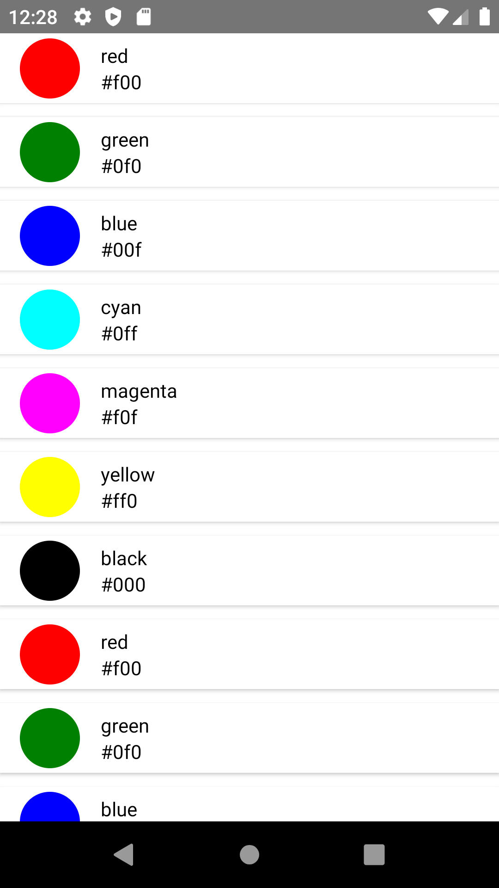
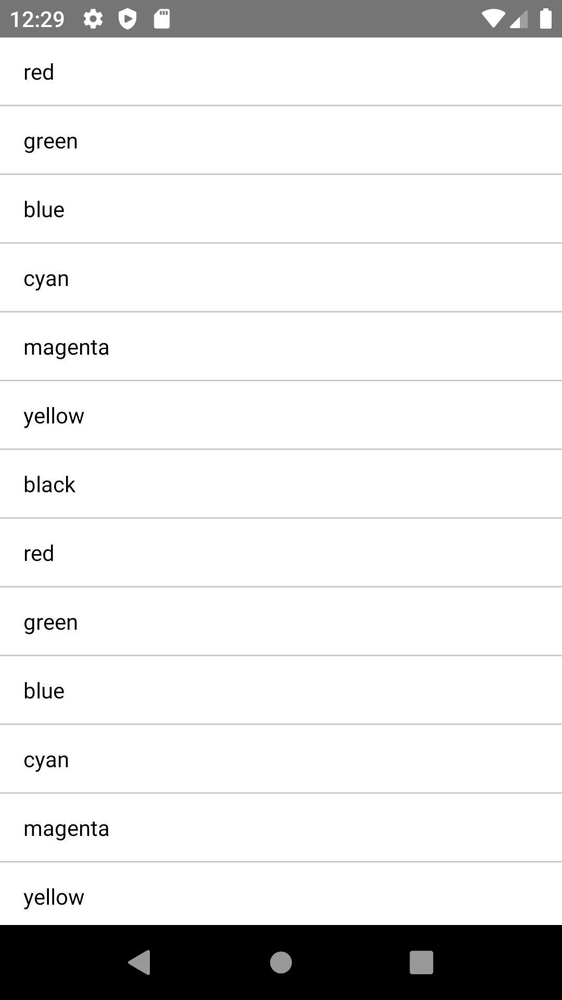

# rn-glt-listview

> A listview component for ReactJS

[](https://www.npmjs.com/package/rn-glt-listview) [](https://standardjs.com) 

```bash
npm install --save rn-glt-listview
or
yarn add rn-glt-listview
```

## Usage

```tsx
import ListView from 'rn-glt-listview';


// mock list data
const list = [
  {
    color: "red",
    value: "#f00"
  },
  {
    color: "green",
    value: "#0f0"
  },
  {
    color: "blue",
    value: "#00f"
  },
  {
    color: "cyan",
    value: "#0ff"
  },
  {
    color: "magenta",
    value: "#f0f"
  },
  {
    color: "yellow",
    value: "#ff0"
  },
  {
    color: "black",
    value: "#000"
  }
]

export default class App extends Component {
  state = {
    hasMore: true,
    list: [],
  };


  _renderItem = ({ item }) => {
        return(
            <View style={[styles.listContainer]}>
                <View style={[styles.colorRound, {backgroundColor: item.color}]}></View>
                <View style={styles.titleContainer}>
                          <Text>{item.color}</Text>
                  <Text>{item.value}</Text>
                </View>
            </View>
        )
    }

  render() {
    const { list } = this.state;

    return (
      <ListView data={list} renderItemFun={this._renderItem}></ListView>
    );
  }
}
const styles = StyleSheet.create({
    container: {
        flex: 1,
    },
	listContainer:{
		flex: 1,
		flexDirection: 'row',
		marginBottom: 10,
		alignItems: 'center',
		height: wp(14),
		paddingHorizontal: wp(4),
		backgroundColor: '#FFF',
		shadowColor: "#000",
		shadowOffset: {
			width: 0,
			height: 1,
		},
		shadowOpacity: 0.20,
		shadowRadius: 1.41,

		elevation: 2
	},
	colorRound:{
		width: wp(12),
		height: wp(12),
		borderRadius: 100,
		marginEnd: 15
	},
	titleContainer:{
		width: wp(84),
		height: wp(12),
		justifyContent: 'center'
	}
});

```
## API
### Props
Prop                | Type     | Optional | Default   | Description
------------------- | -------- | -------- | --------- | -----------
`contentContainerStyle`| object   | Yes      |           | Style of flatlist container.
`itemContainerStyle`         | object   | Yes      |           | Style of item. **Invalid in wrapper mode.**
`textStyle`     | object   | Yes      |           | Style of text of item.
`dropdownTextStyle` | object   | Yes      |           | Style of the dropdown option text.
`dropdownTextHighlightStyle`   | object | Yes      |  | Style of the dropdown selected option text.
`renderItemFun`         | func     | Yes      |           | Customize render option rows: `function()` **Will render a default row if `undefined`.**
`showsVerticalScrollIndicator`          | bool     | Yes      | false    | Default false if you want to enable scroll do it true.

```
```

## Example

### With custome render



### Default Render



## License

MIT © [gtl_parth]
